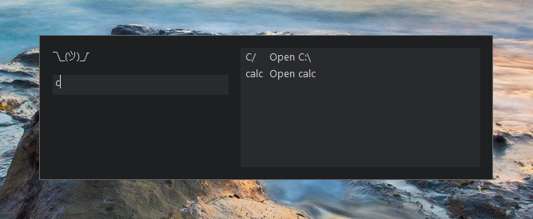

# Launcher

An utility for launching various things.
Designed to be as flexible as possible.

Concept taken from <https://github.com/plul/Public-AutoHotKey-Scripts>.
I started with this repository and slowly rewrote everything.
Only things left are colors and default window title.
The project got a lot bigger but also a lot more powerful.



## Table of contents

- [Features](#features)
- [Installation & configuration](#installation--configuration)
- [How to use](#how-to-use)
- [Examples](#examples)
- [Documentation](#documentation)
- [To do & ideas](#to-do--ideas)

## Features

1. Quickly open website, folder, program etc.
1. See list with available commands
1. Group commands automatically
1. Change method of opening, e.g. copy path to clipboard instead of opening
1. Block some commands based on time of day, current desktop or any other rule
1. Support for Firefox profiles and [Windows runas](https://en.wikipedia.org/wiki/Runas)
1. Built-in editor for simple commands

## Installation & configuration

Unfortunately only works with Windows.

1. Install latest [AutoHotkey v1.1](https://autohotkey.com/download/)
1. Clone or download this repository
1. Test by running [LauncherSample.ahk](LauncherSample.ahk) (press `Ctrl+/` to open GUI)

### Add your own commands

1. Copy [LauncherSample.ahk](LauncherSample.ahk) to `Launcher.ahk`
1. Copy [UserConfig/CommandsSample.ahk](UserConfig/CommandsSample.ahk) to `UserConfig/MyCommands.ahk`
1. Edit include path in `Launcher.ahk` to point to `UserConfig/MyCommands.ahk`
1. Add your commands to `UserConfig/MyCommands.ahk`

### Install extension dependencies (optional)

1. Run `git submodule update --init --recursive` to install dependencies needed for extensions

### Create repository for your commands (optional)

If you know how to use git, storing your config in repository makes it easier to play with configuration because you can always go back to working one. Don't worry, the repository would be separate from this one.

```bash
cd UserConfig
git init
git add UserCommands.ahk
git commit -m "Default commands configuration"
```

## How to use

1. Run `Launcher.ahk`
1. Press hotkey (default: `Ctrl+/`) to open GUI
1. Type something, e.g. `goo` to open `google.com`
1. Add some commands to `UserConfig/MyCommands.ahk`
1. Open GUI and type `rel` to reload script and see your changes

## Examples

There are some examples in [Examples](Examples/) directory showing different features.
Examples are numbered to make a tutorial.
Start with `1_Basic.ahk`.

To run the example:

1. Run [RunExample.ahk](RunExample.ahk) and select an example.
1. Open gui with hotkey (`usually Ctrl+Shift+/`)
1. Check source in editor (I recommend Visual Studio Code with AutoHotkey extension)

Example files are self-contained - they contain both commands definition (like `UserConfig/MyCommands.ahk`) and general setup and hotkey (like `Launcher.ahk`)

## Documentation

See [Top level view](Docs/TopLevelView.md) for explanation of most important classes and concepts.

Many source files contain comments.

## To do & ideas

- Add missing examples:
  - multiple controllers & guis
  - blocking commands
  - observing CommandSets
  - desktops extension
  - users extension
  - commands file extension
- Add documentation for extensions
- Option for hiding command in help view
- Better object duplication (support circular references and decorators)
- Deep filter/map in pipeline
- Notify user when command key already exists
- Support for UWP apps
- Add more options for GUI controls
- Mappers
- Save some changed settings to file
- Fuzzy matching
- Tests
- Internationalization
